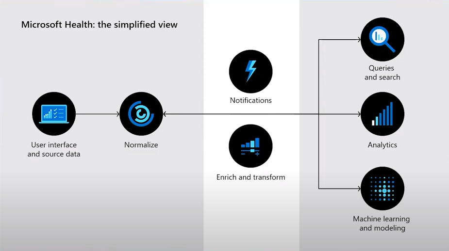

# Azure API for FHIR - Demo Showtime

## Prerequisites
Make sure to have the Azure API for FHIR service active. Setting up the demo is explained in the [demo preparation document](./Prepare-Demo.md).
> It will take significant time to setup the demo, it is probably best to do so at least one day before you run the demo.

## Some background about FHIR

[FHIR](http://hl7.org/fhir/R4/index.html) stands for Fast Healthcare Interoperability Resources. It allows patient data to be 'shared' between different health departments. Lack of interoperability of patient data can lead to increased chances of medical errors and wasting healthcare budget.

**A more formal definition:** An Interoperability standard intended to facilitate the exchange of health care information between healthcare providers, patients, caregivers, payers, researchers and anyone else involved in the healthcare ecosystem. It consists of two main parts: a content model in the form of resources and a specification for the exchange of these resources in the form of real time restful interfaces as well as messaging and documents.

FHIR has become the preferred standard for exchanging electronic health information and enabling the management of PHI data in the cloud.

**The vision / promise:** A world in which everyone can securely access and use the right health data when and where they need it.

Today, there are two Microsoft offerings:
* [FHIR Server for Azure](https://github.com/Microsoft/fhir-server)
    * Open source, full control - Implemented using .NET Core

* [Azure API for FHIR](https://docs.microsoft.com/en-us/azure/healthcare-apis/fhir/overview)
    * Fully managed enterpirse-grade PaaS, distribution of the FHIR Server for Azure
	* Meets Protected Healthcare Information (PHI) regulatory compliance requirements

In this demo we focus on the Azure API for FHIR.

> Make sure to delete all resources after the demo to limit unnessesary spending. The Azure API for FHIR (just the service itself) costs approx. $10 / day.

FHIR as a system / solution to solve problems: Architecture Backround

We are using a conceptual architecture. Concept in architecture is similar to the concept of a book. The concept does not dictate the final manifestation (or the combination of words in a book), but instead sets up a sort of theme and essence that guides and gives some structure to work with / from. Formally: A concept is a **self imposed constraint**.

Checkout [these videos](https://www.youtube.com/playlist?list=PL8nfc9haGeb7zEgT3DXS110BgY5032bf1) for more background info.

## Step-by-Step instructions

