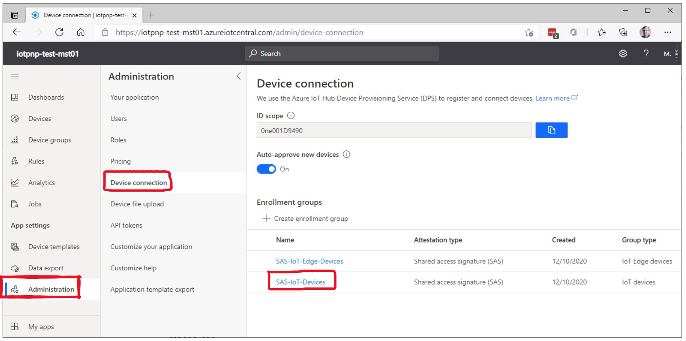
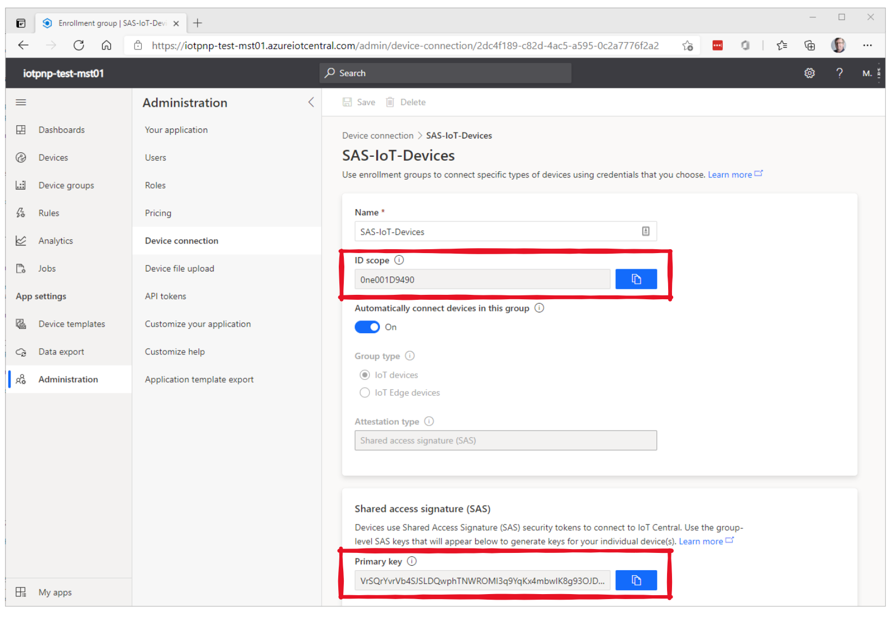
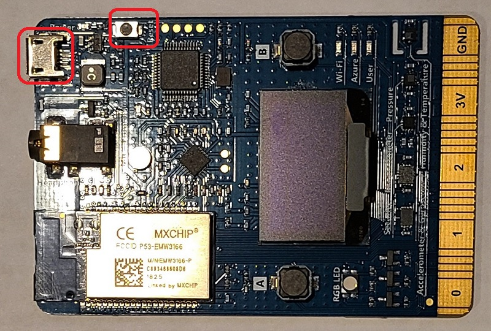
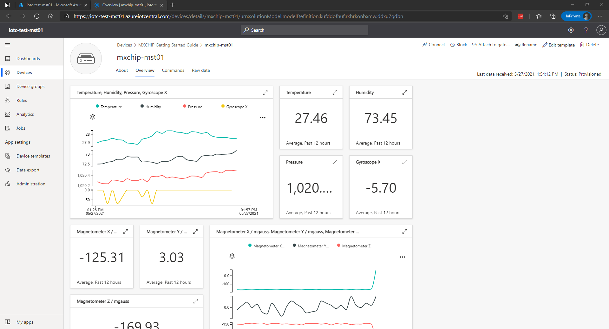
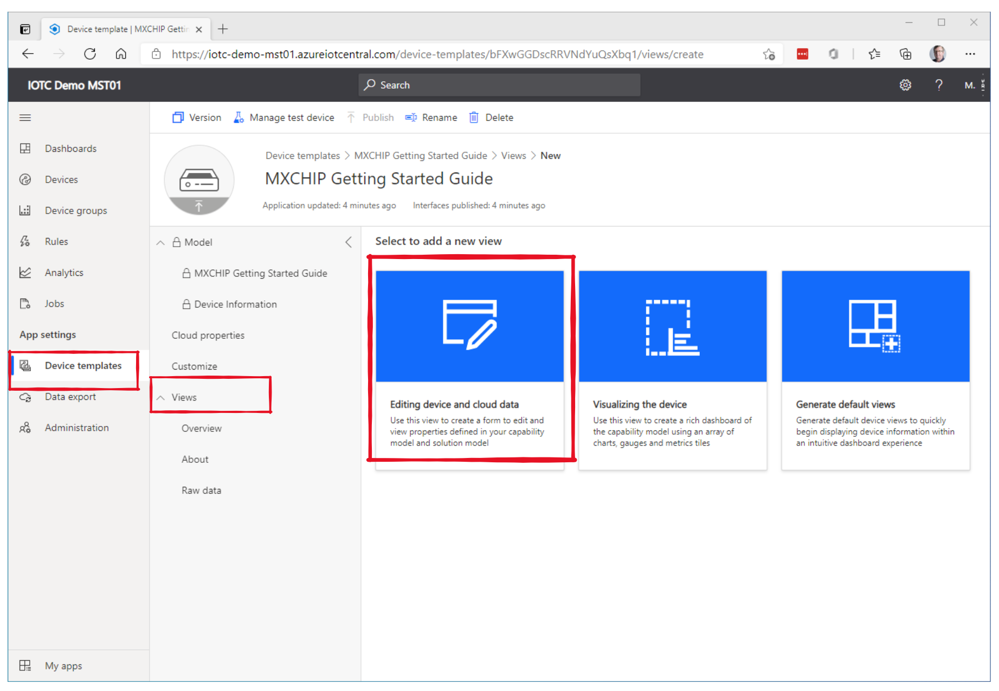
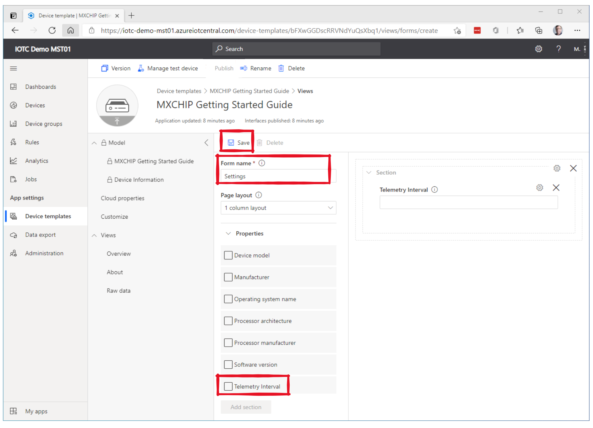
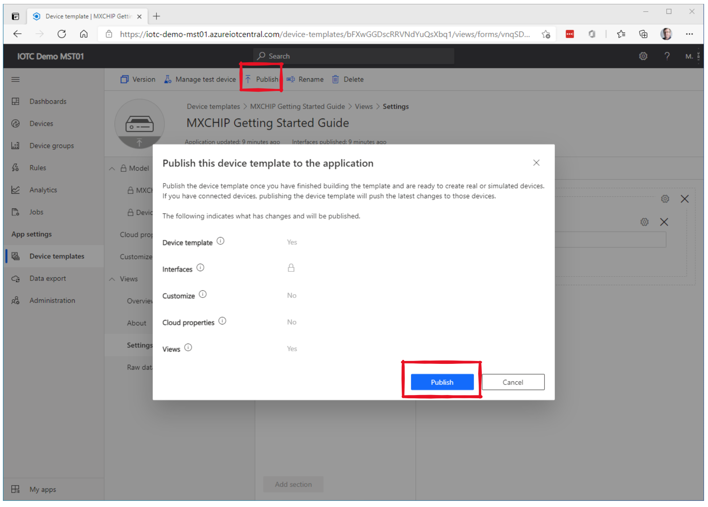

# IoT PnP with MXChip - Demo Showtime

## Time to execute the demo

This demo can be shown in as little as **5 minutes**. It can easily blow away customers / partners. Just make sure to explain that a real application will take longer to build. A more realistic demo, where you also show how to configure the MXChip device will take approximately **15 minutes**.

## Prerequisites
Make sure to have cloned and build the MXChip image. This is explained in the [demo preparation document](./Prepare-Demo.md).

## Demo Purpose

This demo shows the power of IoT Plug and Play in combination with an Azure IoT Central application. Take a look at the [IoT Plug and Play](https://docs.microsoft.com/en-us/azure/iot-pnp/overview-iot-plug-and-play) and [Azure IoT Central](https://docs.microsoft.com/en-us/azure/iot-central/core/overview-iot-central) documentation to get enough background information for your partner / customer conversation. At the end of this description, there are also a few details on how IoT Plug and Play is implemented, in this case by using the [Azure SDK for Embedded C](https://github.com/Azure/azure-sdk-for-c/tree/master/sdk/docs/iot). You don't have to mention these low level details when running a demo, but they might help if your customer has additional questions.

## Step-by-Step instructions

> For the 5 minute demo, create an IoT Central application and get the WiFi + device details into your device before your demo. Don't power-up the device until the actual demo.

### Create the Azure IoT Central application

There are several ways to connect devices to Azure IoT. During the demo, you will create a new Azure IoT Central application using In this section, you learn how to connect a device by using Azure IoT Central. IoT Central is an IoT application platform that reduces the cost and complexity of creating and managing IoT solutions.

To create a new Azure IoT Central application:

1. Modify the environment variables in the script ```create-iotc-demo-app.sh``` to your taste.
1. Execute the bash script ```create-iotc-demo-app.sh``` that is part of this repository in a WSL console with the [az cli](https://docs.microsoft.com/en-us/cli/azure/install-azure-cli-linux?pivots=apt) + iot extension installed, or from an Azure Cloud Shell. If you are using the az cli locally, make sure you are signed in to the subscription on which you want to create your Azure IoT Central application.

    > If you have an existing IoT Central application, you can use it to complete the steps in this article rather than create a new application.

### Get the device connection details to register a new device

1. In the **Device connection** page of your Azure IoT Central application, under **Enrollment groups** click on the **SAS-IoT-Devices** link.
1. Copy the value for **ID scope** and **Primary key** inside the **Shared access signature (SAS)** section.

    

1. In the **SAS-IoT-Devices** page, copy the values for **ID scope** and **Primary key**.

    
1. In the WSL console or the Azure Cloud Shell that you used in step 2, enter the following command to create a Device SAS Key, passing the **Primary key** and a unique **Device name** as parameters.

    ```shell
    az iot central device compute-device-key --device-id <device_name> --pk <primary_key>
    ```
### Prepare the device

To connect the MXCHIP DevKit to Azure, you'll modify a configuration file for Wi-Fi and Azure IoT settings, rebuild the image, and flash the image to the device.

1. Open the following file from the cloned repository in a text editor (for instance in Visual Studio Code):

    > *getting-started\MXChip\AZ3166\app\azure_config.h*

1. Set the Azure IoT device information constants to the values that you saved after you created Azure resources.

    |Constant name|Value|
    |-------------|-----|
    |`IOT_DPS_ID_SCOPE` |{*Your ID scope value*}|
    |`IOT_DPS_REGISTRATION_ID` |{*Your device-id value*}|
    |`IOT_DEVICE_SAS_KEY` |{*Your Primary Device SAS Key*}|

1. Save and close the file.

### Build the image

1. In a console window, navigate to the following folder:

    > *getting-started\MXChip\AZ3166\build*

1. Execute the following command to build the image:

    > ```cmake --build .```

### Flash the image

1. On the MXCHIP DevKit, locate the **Reset** button, and the Micro USB port. You use these components in the following steps. Both are highlighted in the following picture:

    

1. Connect the Micro USB cable to the Micro USB port on the MXCHIP DevKit, and then connect it to your computer.
1. In File Explorer, find the binary file that you created in the previous section. The file is located in the following folder:
    > *getting-started\MXChip\AZ3166\build\app*

1. Copy the binary file *mxchip_azure_iot.bin*.
1. In File Explorer, find the MXCHIP DevKit device connected to your computer. The device appears as a drive on your system with the drive label **AZ3166**.
1. Paste the binary file into the root folder of the MXCHIP Devkit. Flashing starts automatically and completes in a few seconds.

    > During the flashing process, a green LED toggles on MXCHIP DevKit.

### Confirm device connection details

You can use a **Termite** or **PuTTY** app to monitor communication and confirm that your device is set up correctly.

1. Start the app to begin monitoring communication.
    > If you are unable to connect Termite to your devkit, install the [ST-LINK driver](https://my.st.com/content/ccc/resource/technical/software/driver/files/stsw-link009.zip) and try again. See  [Troubleshooting](https://github.com/azure-rtos/getting-started/blob/master/docs/troubleshooting.md) for additional steps.
1. Make sure that the following serial port settings are set:
    * **Baud rate**: 115,200
    * **Port**: The port that your MXCHIP DevKit is connected to. If there are multiple port options in the dropdown, you can find the correct port to use. Open Windows **Device Manager**, and view **Ports** to identify which port to use.
1. Share the output of your RS232 terminal app to the audience to show them that the device connects through the DPS service and shares its device model id:

    ```output
    Starting Azure thread

    Initializing WiFi
    	Connecting to SSID 'iot'
    SUCCESS: WiFi connected to iot

    Initializing DHCP
    	IP address: 10.0.0.123
    	Mask: 255.255.255.0
    	Gateway: 10.0.0.1
    SUCCESS: DHCP initialized

    Initializing DNS client
    	DNS address: 10.0.0.1
    SUCCESS: DNS client initialized

    Initializing SNTP client
    	SNTP server 0.pool.ntp.org
    	SNTP IP address: 185.242.56.3
    	SNTP time update: Nov 16, 2020 23:47:35.385 UTC 
    SUCCESS: SNTP initialized

    Initializing Azure IoT DPS client
    	DPS endpoint: global.azure-devices-provisioning.net
    	DPS ID scope: ***
    	Registration ID: ***
    SUCCESS: Azure IoT DPS client initialized

    Initializing Azure IoT Hub client
    	Hub hostname: ***
    	Device id: ***
    	Model id: dtmi:azurertos:devkit:gsgmxchip;1
    Connected to IoTHub
    SUCCESS: Azure IoT Hub client initialized

    Starting Main loop
    ```
## View telemetry

With IoT Central, you can view the flow of telemetry from your device to the cloud. You should also point the audience to the fact that the earlier empty IoT Central now has a device connected and even has a User Interface.

1. View the telemetry as the device sends messages to the cloud in the **Overview** tab.

    

    > You can also monitor telemetry from the device by using the Terminalte app.

## Call a direct method on the device

You can also use IoT Central to call a direct method that you have implemented on your device. Direct methods have a name, and can optionally have a JSON payload, configurable connection, and method timeout. In this section, you call a method that enables you to turn an LED on or off.

To call a method in IoT Central portal:

1. Select the **Command** tab from the device page.

1. Select **State** and select **Run**.  The LED light should turn on.

1. Unselect **State** and select **Run**. The LED light should turn off.

## View device information

You can view the device information from IoT Central.

1. Select **About** tab from the device page.

## Optionally extend the IoT Central Application with a Settings Form

You can easily modify / extend the device user interface. In this sample we will show how to add a Settings dialog that can set the interval time between two telemetry messages.

1. Go to the Device templates in your IoT Central application, click on the Views tab and click on the **Editing device and cloud data** icon.

    

1. Optionally change the **Form name**, for instance to **Settings**, expand the properties and select the checkbox for **Telemetry Interval**, followed by clicking the **Add Section** button.
1. Click the **Save** button

    

1. To make the new / modified UI visible for the device, finally click the **Publish** button, followed by the Publish button on the dialog.

    

1. Show your device again and navigate to its newly available **Settings** form.


## Clean-up demo resources

After you have finished your demo, you can clean up the used resources by executing the script after you have powered down your MXChip device.

1. Modify the environment variables in the script ```delete-iotc-demo-app.sh``` so that they are identical to the environment variables you used in the script ```create-iotc-demo-app.sh```.
1. Execute the bash script ```delete-iotc-demo-app.sh``` that is part of this repository in a WSL console with the [az cli](https://docs.microsoft.com/en-us/cli/azure/install-azure-cli-linux?pivots=apt) + iot extension installed, or from an Azure Cloud Shell. If you are using the az cli locally, make sure you are signed in to the subscription for which you want to delete your Azure IoT Central application.

## Additional implementation details

This section helps you to understand what is happening under the covers when an IoT Plug and Play capable device connects for the first time to an IoT Hub or IoT Central application. You don't have to share this info with your solution building partner / customer, but when they have more detailed questions, this section might help you answering those.

All examples in the **getting-started** repo make use of a device model that is available in [this repository](https://github.com/Azure/iot-plugandplay-models/tree/main/dtmi), or more specific at [this location](https://github.com/Azure/iot-plugandplay-models/tree/main/dtmi/azurertos/devkit). This is where the model (json) is defined. The tree in this GitHub repository maps to the model identifier (dtmi:azurertos:devkit:gsgmxchip).

In source code in the **getting-started** repo, the model is defined in the file **nx_client.c** at line 24. In the same source file, we pass the model to a function called ```azure_iot_nx_client_create``` at line 319. This function is defined in a shared code base for all getting-started samples. The source file can be found here under the getting-started tree: core\src\azure_iot_nx. 
 
In that file, you will find the function ```azure_iot_nx_client_create``` at line 466. In that function, we create a thread that deals with initializing our application (reaching out to DPS, retrieving the IoT Hub to connect to, deal with certificates, but also inform IoTHub or IOTC App) that we have a PnP Model, identified by ```dtmi:azurertos:devkit:gsgmxchip```. 
 
When the device connects initially, IOTC tries to find the model in a global repository containing PnP certified devices. If it finds it, IOTC *knows* what telemetry, commands and properties are defined in the model and creates a very basic UI around them. If the model is not found (not part of the PnP public repository), the device can still connect, but IOTC cannot automatically import PnP capabilities of the device. In that case, you manually have to import the device model into the IoTC application.
 